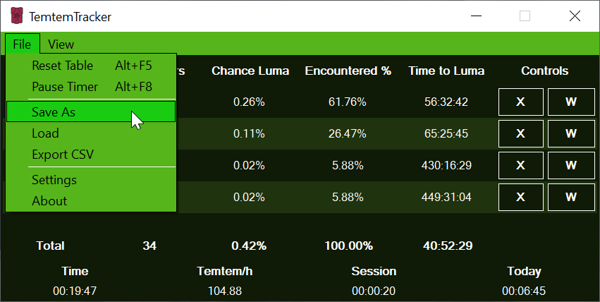
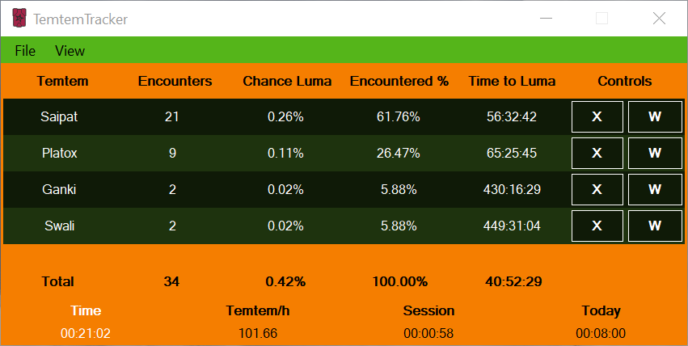
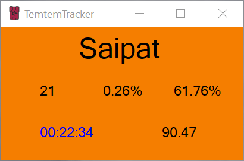
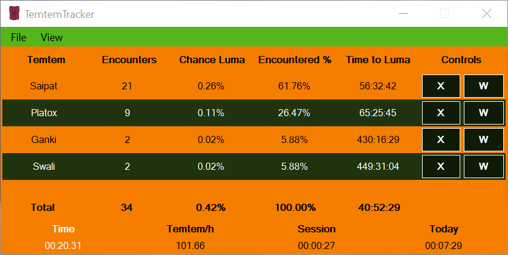
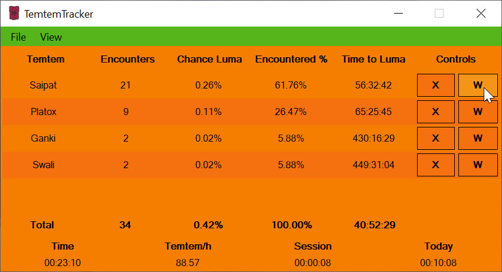

# TemtemTracker Themes How To

TemtemTracker supports themes or styles. These are located each within their own subfolder in the styles folder.

Each style needs to have its own folder and a Manifest.json file within the folder, the contents of which are as follows:

``` JSON
{
        "styleVersion": 2,
		"styleName":"GracefulKlutz",
        "menuStripBackground": "#55B51A",
        "menuStripForeground": "#000000",
        "toolStripBackground": "#55B51A",
        "menuItemSelected": "#19CC12",
        "trackerBackground": "#F57E00",
        "trackerForeground": "#000000",
        "timerForeground": "#000000",
        "timerPausedForeground": "#0000FF",
        "tableRowBackground1": "#F57E00",
        "tableRowBackground2": "#F5710F",
        "tableRowForeground1": "#000000",
        "tableRowForeground2": "#000000",
        "tableRowButtonHoverColor": "#F59517",
        "tableRowButtonBackground": "#F5710F",
        "tableRowButtonForeground": "#000000",
        "tableRowButtonBorderColor": "#000000" 
}
```
In JSON files strings (groups) of characters (letters) need to be surrounded by quotation marks, while numbers do not. As long as more lines follow each line needs to end in a comma.

## Style version and name

The following 2 lines are very important for your style:

``` JSON
"styleVersion": 2,
"styleName":"GracefulKlutz",
```
In the current version of TemtemTracker the styleVersion is 2. Other versions will result in the tracker reporting errors due to outdated styles and they will not be usable. This is to avoid outdated styles causing issues if styles are updated in the future.
The style name is the name that will show up in the Settings Window when selecting the style. These MUST BE unique.

## Menu strip

The following four properties determine the background color of the menu strip, the text in the menu strip and dropdowns, the dropdown background color and the color of elements in the menu and dropdown that are hovered:

``` JSON
"menuStripBackground": "#55B51A",
"menuStripForeground": "#000000",
"toolStripBackground": "#55B51A",
"menuItemSelected": "#19CC12",
```
The effect of these properties can be seen in the following image:



menuStripBackground and toolStripBackground are the green background color visible in the menu at the top of the tracker window. The menuStripForeground color is the black color of the text in the menu and dropdown. The menuItemSelected color is the bright green color visible on the Save As menu item that currently has the mouse pointer hovering above it.

## Main tracker body and individual windows

The following two properties determine the background color of the main tracker body and the text in the table header, totals and the Temtem/h, Session and Today titles and values:

``` JSON
"trackerBackground": "#F57E00",
"trackerForeground": "#000000",
```
The effect of these properties can be seen in the following image:



The bright orange color is the trackerBackground color.
The black text color of the table header, total values and Temtem/h, Session and Today titles and values is the trackerForeground color.

Notice that the table itself, the buttons and the table text color is not modified by this. These are separate values.

These two properties also determine the background and text color in the individual tracker windows, with the exception of the timer which has its own text color as well as a special color for when the timer is paused.



## The timer

The following two properties determine the text color of a running timer and the text color of a paused timer, both in the main tracker window and in the individual tracking windows:

``` JSON
"timerForeground": "#000000",
"timerPausedForeground": "#0000FF",
```
The blue timerPausedForeground color can be seen in the individual tracking window shown at the end of the previous example, as well as the following image:


## The table

The following properties determine the background and text colors of the individual rows in the table in the main window:

``` JSON
"tableRowBackground1": "#F57E00",
"tableRowBackground2": "#F5710F",
"tableRowForeground1": "#000000",
"tableRowForeground2": "#000000",
```
The effects can be seen in the following images:




In the first image only the tableRowBackground1 and tableRowForeground1 properties have been modified compared to the style used as a template. This results in every second table row color changing, beginning with the 1st row.

In the second image the tableRowBackground2 and tableRowForeground2 properties have been modified, resulting in every second table row color changing beginning with the 2nd row. 

Differentiating these rows with nuances of color allows for easier visual distinguishing between table rows and counting.

## The buttons

The following properties determine the colors of the X and W buttons in each row of the table in the tracker:

``` JSON
"tableRowButtonHoverColor": "#F59517",
"tableRowButtonBackground": "#F5710F",
"tableRowButtonForeground": "#000000",
"tableRowButtonBorderColor": "#000000" 
```

The tableRowButtonHoverColor property determines the button background color when the mouse pointer is hovering above it. This is used to visually indicate that your pointer is above a button.

The tableRowButtonBackground property determines the color of the background of a button when it does not have a mouse pointer hovering above it.

The tableRowButtonForeground property determines the color of the text inside the button.

The tableRowButtonBorderColor property determines the color of the button border.

The effects of these properties can be seen in the following image:


