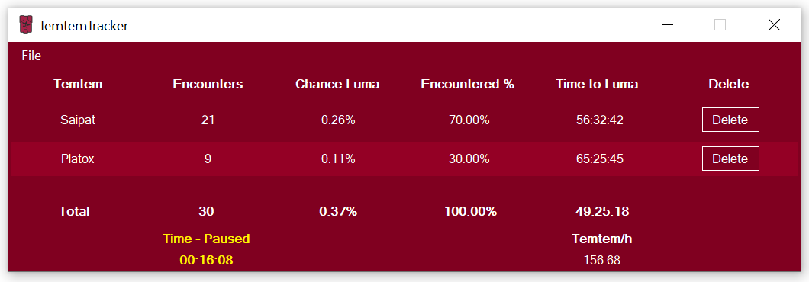

# Temtem Tracker

### Scroll to Releases below for download

Temtem Tracker is a tracker for encountered Temtem based on Optical Character Recognition. 

The tracker: 
* **DOES NOT** read Temtem memory. 
* **DOES NOT** intercept any Client-Server communication. 
* **DOES NOT** send any requests of its own to any server.
* **DOES NOT** automate any part of gameplay
* **DOES NOT** do anything a player couldn't do themselves using pen and paper
* **WILL NOT** get you banned

## Requirements

If your tracker isn't working at all, it may be due to you lacking the required software packages.

**TemtemTracker V3 requires .NET 4.5.2  and Visual C++ Redistributable 2017 in order to work.** 

Windows 10 users most likely already have .NET, as it is part of the Windows 10 Creators Update.

.NET 4.5.2 For Win 8.1 and lower can be found here: [.NET 4.5.2](https://www.microsoft.com/en-us/download/details.aspx?id=42642);

Visual C++ Redistributable 2017 can be downloaded here: 

- [vc_redist.x86.exe (32-bit)](https://aka.ms/vs/16/release/vc_redist.x86.exe)
- [vc_redist.x64.exe (64-bit)](https://aka.ms/vs/16/release/vc_redist.x64.exe) 

OR found here: [Latest supported Visual C++ Downloads](https://support.microsoft.com/en-us/help/2977003/the-latest-supported-visual-c-downloads)

## Releases

#### Current release:

- [TemtemTracker V3.1](https://github.com/mculig/TemtemTracker/releases/download/V3.1/TemtemTracker_v3.1_x64.zip)
- [TemtemTracker V3.1 (32-bit)](https://github.com/mculig/TemtemTracker/releases/download/V3.1/TemtemTracker_v3.1_x86.zip)

#### Old releases:

[Releases](https://github.com/mculig/TemtemTracker/releases)

## Important notes

For the application to work you **MUST NOT** obstruct any of the interface elements used for detection (Spots 1-6 in images below) OR OCR (Frames 1 and 2 in images below)

## Controls

Default:

* Reset table and timer: ALT+F5
* Pause/restart timer: ALT+F8

These can be remapped in the settings

Row buttons:

* X: Delete row
* W: Open individual row window

## Update notes

### V3.1

#### New features

- Added 16:3 and 4:3 aspect ratios to config
- Added support for multiple Temtem windows/clients running simultaneously
- Added log generation for unhandled crashes
- Added auto-pause feature to settings
- Changed style organization from single file to individual style folders/manifests. This should make it easier to share styles
- Added more robust and informative error handling for styles to support style development
- Added additional options to styles: tableRowButtonBorderColor and toolStripBackground
- Added individual tracking windows, minimalist windows that can be used to track a single Temtem while still keeping an eye on time and temtem/h. 

#### Bugfixes/optimization

- Fixed detection not working monitors other than main monitor

### Update history

[UpdateHistory](UpdateHistory.md)

## How it works

The application relies on several dots to identify in-combat and out-of-combat situations, and 2 Frames to identify Temtem names using OCR. These dots and frames can be seen on the following 2 images:

The dots are marked 1-6 and are positioned at a location on the screen determined by the values:

* spotXWidthPercentage
* spotXHeightPercentage

In TemtemTracker/config/config.json

The ARGB values the application tests for can also be found in the config file:

* spotXRGB

The application has been tested to work at common 16:9 and 16:10 resolutions in windowed, borderless and fullscreen mode without the need to modify the spot locations in the config file.

The OCR Frames location and dimensions are determined by the values:

* frameXPercentageLeft
* frameXPercentageTop
* frameWidthPercentage
* frameHeightPercentage

The application interface (Tsukki theme) can be seen on the following image: 

The application tracks Temtem encountered, the number of encounters, the chance of having encountered a Luma of that species and the % that species represents in the total number of Temtem encountered, as well as totals for these values.

The Luma chance is based on the lumaChance value in TemtemTracker/config/config.json

The Window dimensions are saved upon exiting the application and can be found in TemtemTracker/config/userSettings.json

Finally, in order to clean up any artifacts in the OCR output, a string comparison operation is executed using the Temtem names found in TemtemTracker/config/temtemSpecies.json. This will need to be updated with new species when their names are released in order to keep the application reliable.