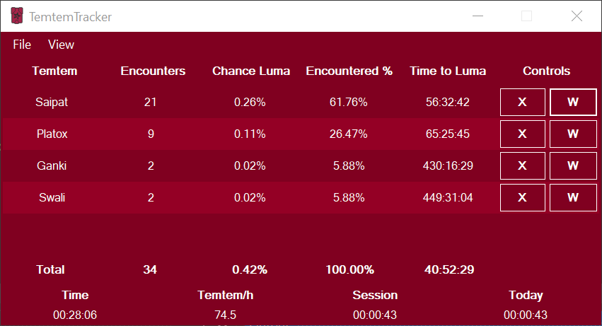
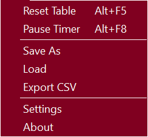
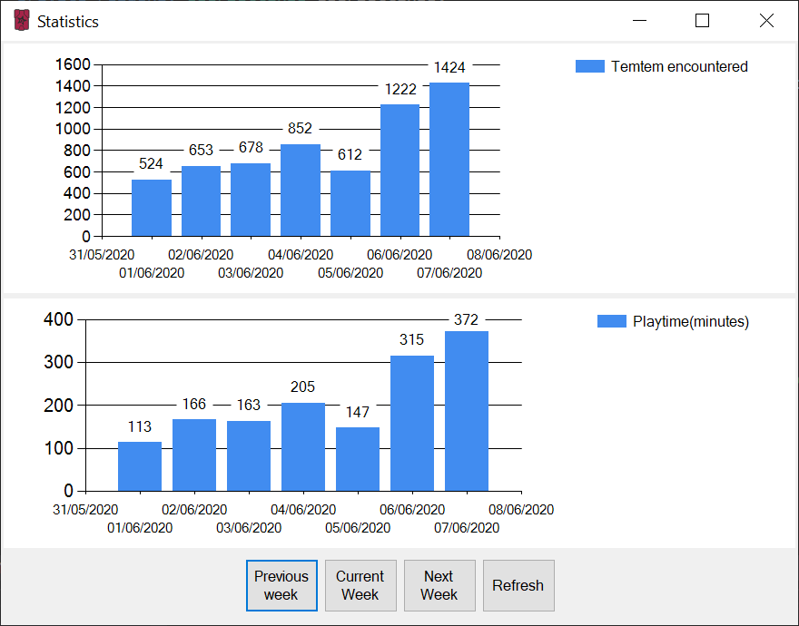
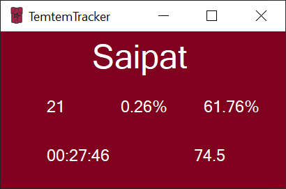

# TemtemTracker Features

In this document the features of the TemtemTracker will be shown and explained.

## Table of Contents

[Other Documents of Interest](#other-documents-of-interest)  
[The Main Window](#the-main-window)  
[The Menu Strip](#the-menu-strip)  
[The Statistics Window](#the-statistics-window)  
[Individual Tracking Windows](#individual-tracking-windows)

## Other Documents of Interest

[Index](Readme.md)  
[How to: Settings](HowToSettings.md)  
[How to: Styles](HowToStyles.md)

## The Main Window

The main TemtemTracker window is the starting point for all interactions with the tracker and displays all the tracked information.

The menu strip and menu items are described in the next section.

Below the menu strip is the main tracker table. In this table the information about your encounters is displayed.

The *Temtem* column shows the names of encountered Temtem. The order is based on order of first encounter.

The *Encounters* column shows the number of encountered Temtem of a particular species.

The *Chance Luma* column shows the chance of having encountered a luma based on that number of encounters and the chance of encountering a luma. This chance is based on the number of encounters and the geometric distribution. It is important to note that this is an overall chance of having encountered a luma within a certain number of encounters and has no bearing on your chance to encounter a luma within your next encounter. Each individual encounter is statistically independend and has the same chance as other encounters for that species at that time. It can help to think of this as the % of players that would have already encountered a luma by that number of encounters, a measure of luck rather than a promise of a luma coming. **YOU ARE NEVER GUARANTEED A LUMA**

The *Encountered %* column shows the relative percentage this Temtem represents in your overall encounters. 

The *Time to Luma* column is an estimate of the time necessary to reach a certain *Chance Luma* % value based on your settings (Default: 50%). This field is purely informative in nature and meant to give a rough estimate of the time you will need to spend luma hunting to reach certain % thresholds. Since you are never guaranteed a luma, this time will not accurately represent the time you will need to spend hunting, but it can give you a rough estimate of the time you **may** need to spend to have a reasonable expectation of having gotten one. Still, it is important to remember that encountering a luma is entirely up to RNG and cannot be guaranteed or expected.

The *Controls* buttons X and W serve two functions. *The X button* allows you to delete a row. This may be useful in the case of a wrong detection or to remove Temtem that aren't of interest when moving around. *The W button* allows you to open a mini-window which contains a condensed version of the information present in the main tracker window but for an individual row. These are called *Individual Tracking Windows* and are explained further below.

The *bottom row* of the table, called the *Total* row shows totals for the information displayed above. The total *Chance Luma* is based on the base chance of encountering a luma (not taking Saipark into account) in that number of encounters.

The bottom row of the main tracker window displays the *Timers* and *Temtem/h*. In order of appearance these are the *Time* spent tracking for this specific table, the *Temtem/h* average for this specific table, the time spent in the current tracking *Session*, meaning the time since the application was started and the total time time spent tracking *Today*

## The Menu Strip

The menu strip is located in the top row of the window, and features two menu items: File and View.

The *View* menu item currently only contains the function to open the Statistics window.

The *File* menu item contains most of the functionality of interest to the user. 

The *Reset Table* function allows the user to clear the table shown in the tracker, removing all the rows and resetting the *Time* timer and *Temtem/h* counter. The *Session* and *Today* timers will still remain the same as these track the time spent tracking in the current day and current tracking session and are independent of the table.

The *Pause Timer* function allows the user to pause all the timers in the tracker when, for example, taking a break.

The current keyboard shortcuts for both functions are displayed in their menu items.

The *Save As* function allows the current table to be saved at a location of your choice. You can load that table at any time using the *Load* function.

The *Export CSV* function exports the current table in the form of a Comma Separated Value (CSV) file which can easily be imported into programs such as MS Office Excel, Open/Libre Office Calc and Google Sheets.

The *Settings* function opens the Settings window where the tracker can be configured. You can read more about that in the [Settings How-To](HowToSettings.md)

The *About* function opens a small window with information about the tracker.

## The Statistics Window

The *Statistics* window displays encounters and time spent playing in on a weekly basis in the form of bar graphs.

Below the charts four buttons can be found.

The *Previous week* button shows information from the previous week.

The *Current week* button returns focus to the current week

The *Next week* button shows the next week from the currently focused week.

The *Refresh* button refreshes the statistics to load the latest values. 

The statistics window values are not refreshed every time the data is updated to avoid unnecessary resource consumption. Instead, they're refreshed every time the window is opened **OR** when the *Refresh* button is pressed by the user.

## Individual Tracking Windows

The individual tracking windows are smaller windows that contain more densely packed information from a single row in the main tracker window.

In the top row of the window the name of the Temtem species being tracked can be seen.

Below it the number of encountered Temtem of this species, the *Chance Luma* and the *Encountered %* values can be seen.

In the row below the *Time* and *Temtem/h* values can be seen.
